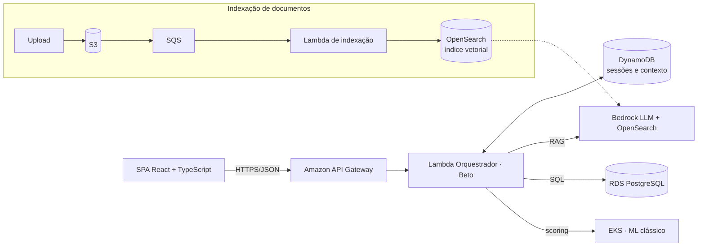

<h1 align="center">🏦 HM Bank · Plataforma de IA Multiagente</h1>

<p align="center">
  Protótipo full stack de uma plataforma corporativa de IA para o setor financeiro:<br>
  um orquestrador, nove agentes especialistas, RAG com fonte citada e governança de ponta a ponta.
</p>

<p align="center">
  
  
  
  
  
  
</p>

<p align="center">
  <a href="https://hagatamendes.github.io/hm-bank-plataforma-ia/"><b>▶ Abrir o protótipo interativo</b></a> ·
  <a href="https://claude.ai/artifact/NrrHjmd19PBve1i7NWhYNX"><b>📄 Ler a documentação técnica</b></a>
</p>

---

> **Nota de escopo:** "HM Bank" é uma marca fictícia. Dados, métricas, pessoas e respostas dos agentes são simulados no navegador. Não há backend real, LLM real nem dado de nenhuma empresa. O objetivo é demonstrar raciocínio de produto, arquitetura e front-end.

## 🎯 O problema

Em muitas empresas, os assistentes de IA são um chatbot genérico que responde sobre qualquer assunto, sem dizer de onde tirou a informação e sem controle sobre quem pode ver qual dado. Num banco isso não é aceitável.

Este protótipo mostra outra abordagem: **vários agentes especialistas**, cada um responsável por um domínio de negócio, coordenados por um orquestrador. Todas as respostas são **rastreáveis**, **auditadas** e **segregadas por departamento**.

## ✨ O que a plataforma faz

| Funcionalidade | Como aparece no protótipo |
|---|---|
| **Orquestração multiagente** | O "Beto" identifica a intenção da pergunta e a encaminha para um de 9 especialistas: Engenharia, Ciência de Dados, Analista de Dados, DevOps, Jurídico, Financeiro, RH, CRM e Risco |
| **RAG com fonte citada** | Cada resposta mostra de quais documentos veio e o nível de confiança. O upload de PDF simula a extração, a divisão em chunks, os embeddings e a indexação vetorial |
| **Text-to-SQL** | O agente Analista de Dados gera a query, mostra a tabela de resultado e o tempo de execução (RDS/PostgreSQL) |
| **NoSQL** | Consultas de sessão e de perfil no formato chave-valor (DynamoDB), exibindo o item bruto |
| **ML clássico + LLM** | O scoring de risco de crédito (regressão logística) e de churn (XGBoost) mostra a importância de cada variável, e o LLM interpreta o resultado |
| **Governança** | Painel de guardrails (mascaramento de CPF, bloqueios e revisão humana) e matriz de acesso por departamento |
| **Observabilidade** | Dashboard de consumo por agente, latência ao vivo, feed de eventos e status dos serviços AWS |
| **Experiência** | Tema claro/escuro, paleta de comandos (Ctrl/⌘ K), ditado por voz, agenda e mensagens internas |

## 🏗️ Arquitetura (desenhada, simulada no front-end)



- **Fluxo síncrono:** a pergunta passa pelo API Gateway e chega ao Lambda orquestrador, que decide entre RAG, SQL ou ML de acordo com a intenção.
- **Fluxo assíncrono:** os documentos seguem por S3, SQS e um Lambda de indexação até o OpenSearch, alimentando a mesma base vetorial usada pelo RAG.
- **Infraestrutura como código:** o provisionamento foi pensado para AWS CloudFormation.
- **Domain-Driven Design e Data Mesh:** cada agente é dono do próprio domínio de dados. O Jurídico não enxerga dados de RH, e o Analista consulta o lakehouse central.

## 🧩 Front-end

```
<App>                    estado global: view, agente ativo, conversas, tema
├─ <Sidebar>
│  ├─ <IconRail>         Mensagens · IA · Agenda
│  └─ <SidebarPanel>     agentes, governança, infraestrutura
├─ <Topbar>              breadcrumb, ambiente, tema, usuário
├─ <ChatThread>
│  └─ <MessageBubble>    texto · SQL · NoSQL · ML · upload
└─ <GovernancePanels>    Dashboard · Guardrails · Acesso · Nuvem
```

- **React 18 + TypeScript** com Vite, sem framework de UI pronto.
- **Design tokens em CSS**, com tema claro, escuro e o tema do sistema.
- O estado funciona como um "backend simulado": foi desenhado para ser trocado por chamadas de API (fetch/React Query) sem reescrever a interface.
- **Próximo passo:** micro-frontends com Webpack Module Federation, com o chat, a governança e as mensagens publicados de forma independente.

## 🚀 Como executar

Projeto em **React 18 + TypeScript** com **Vite**.

```bash
git clone https://github.com/HagataMendes/hm-bank-plataforma-ia.git
cd hm-bank-plataforma-ia
npm install
npm run dev        # ambiente de desenvolvimento em http://localhost:5173
npm run typecheck  # checagem de tipos com o TypeScript
npm run build      # build de produção em dist/
```

Na tela de login, as credenciais de demonstração já vêm preenchidas: é só clicar em **Entrar** ou escolher um perfil.

A cada push na `main`, um workflow do GitHub Actions roda o typecheck e o build e publica o protótipo no **GitHub Pages**.

## 📁 Estrutura

```
├── index.html               ponto de entrada do Vite
├── src/
│   ├── main.tsx             bootstrap do React
│   ├── App.tsx              componentes, agentes, painéis e lógica simulada
│   └── styles.css           design tokens (tema claro/escuro) e estilos
├── docs/
│   └── arquitetura.html     documentação técnica: decisões, diagrama e requisitos
├── .github/workflows/
│   └── deploy.yml           CI: typecheck, build e deploy no GitHub Pages
├── package.json · tsconfig.json · vite.config.ts
```

## 👩‍💻 Autora

**Hágata Mendes**, Analista de Dados Sênior
[LinkedIn](https://www.linkedin.com/in/hagatamendes/) · [GitHub](https://github.com/HagataMendes)
